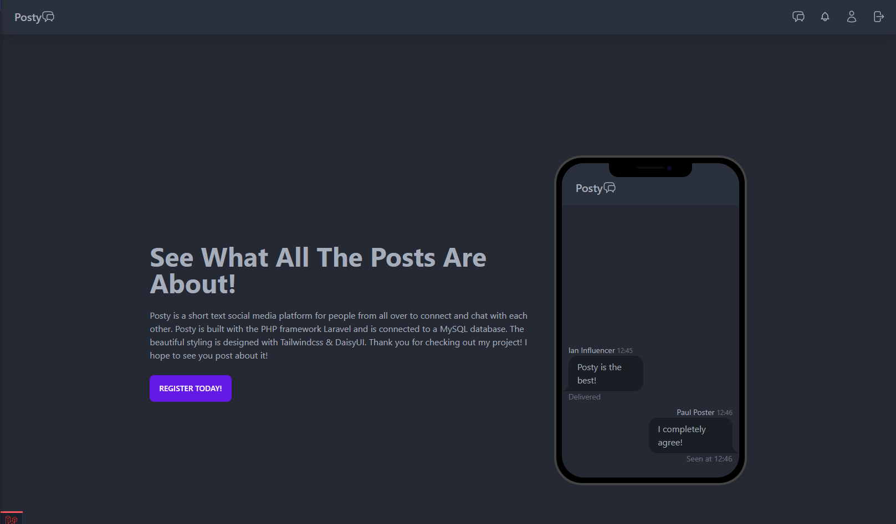
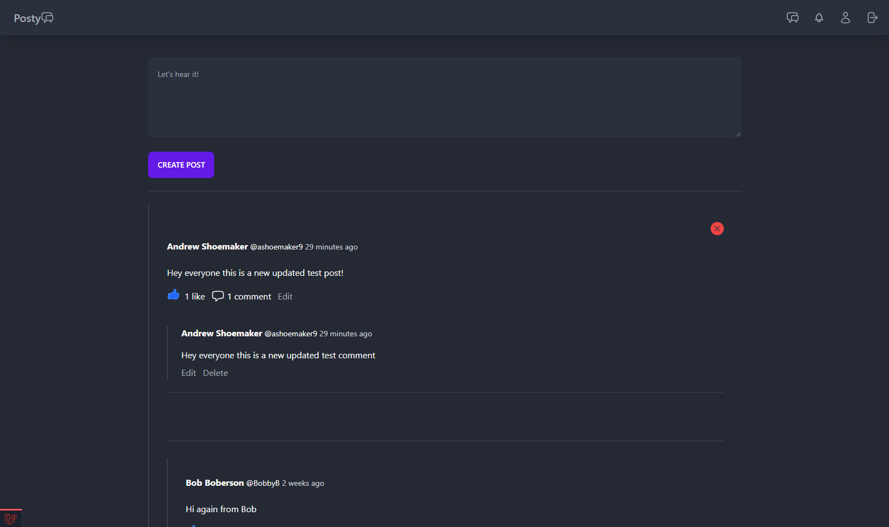

# Posty 

## A short post social media project.

### Built with: Laravel and Tailwindcss

This is a social media project that includes user authentication, email sending and crud functionality.

The UI is built with blade templates and tailwindcss for styling. 

User can register, login, use remember me for faster login, create update and delete posts, and like other users posts. When you like someones post for the first time it will notify the poster that you liked their post. 

Home Page of the project 

The Post page of the project when logged in
